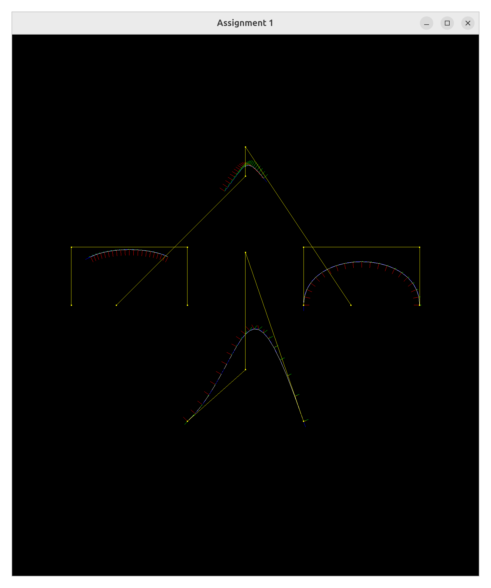
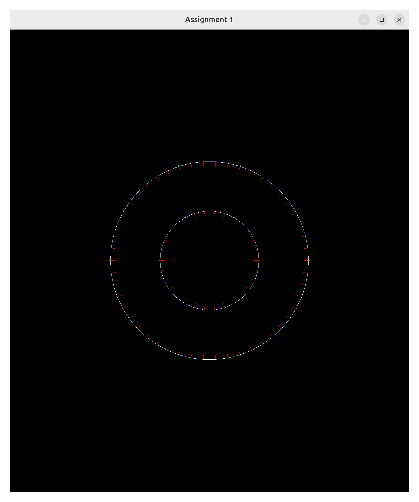
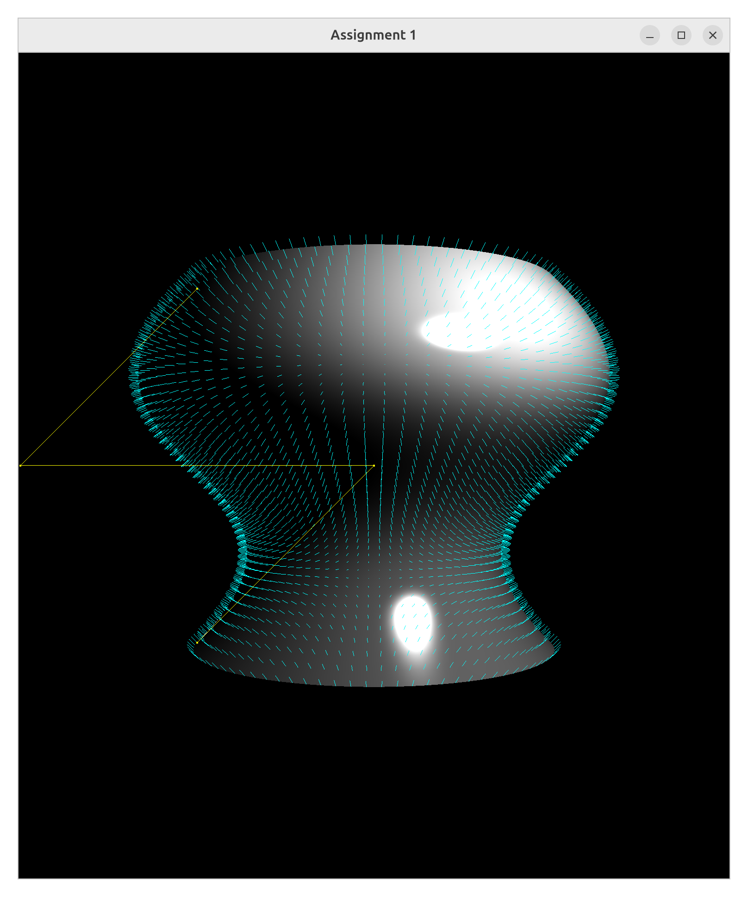
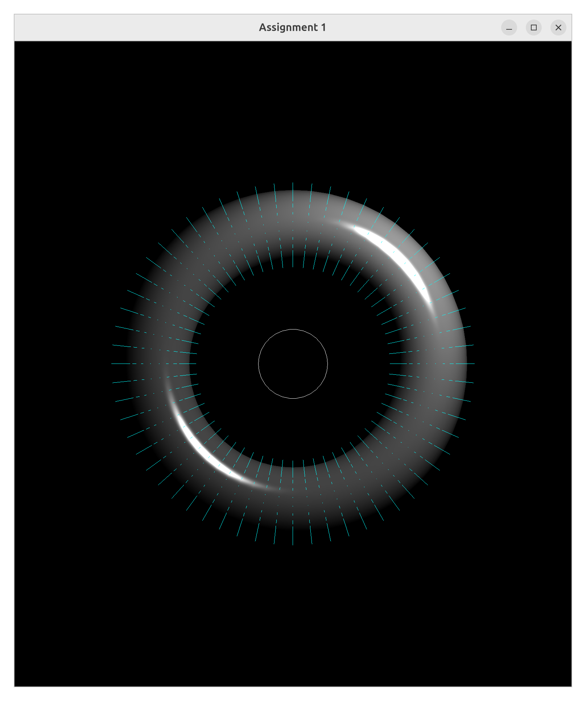
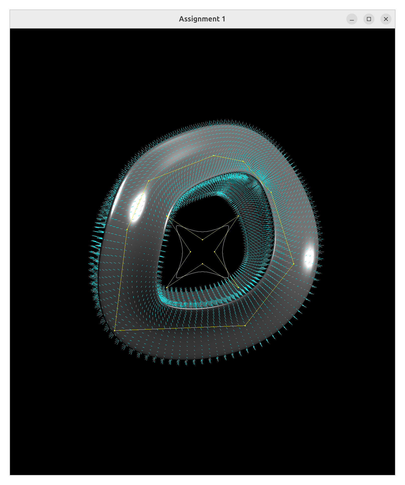
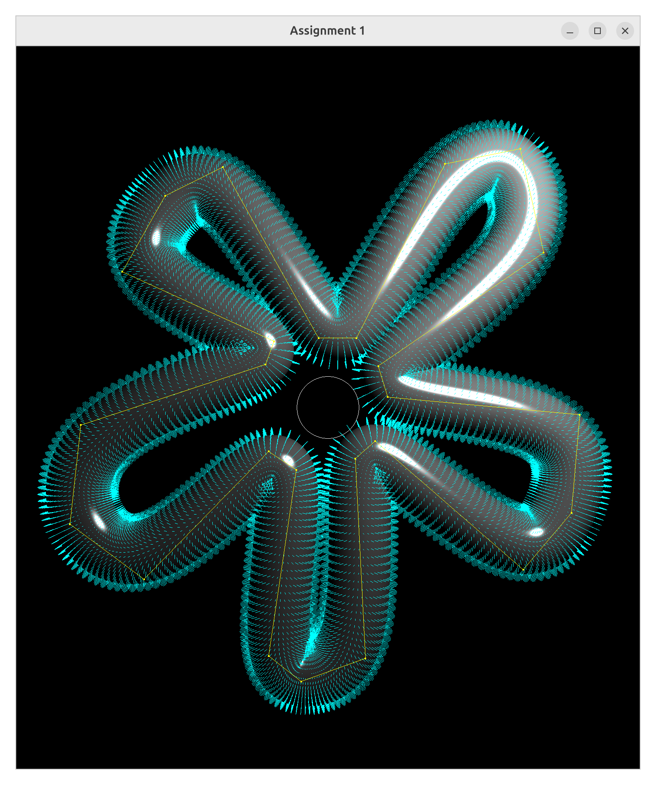
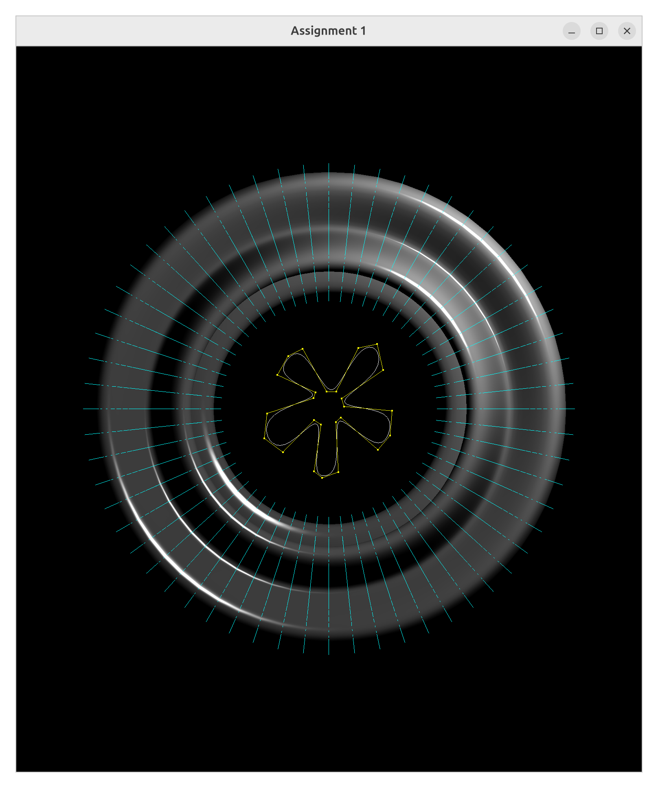
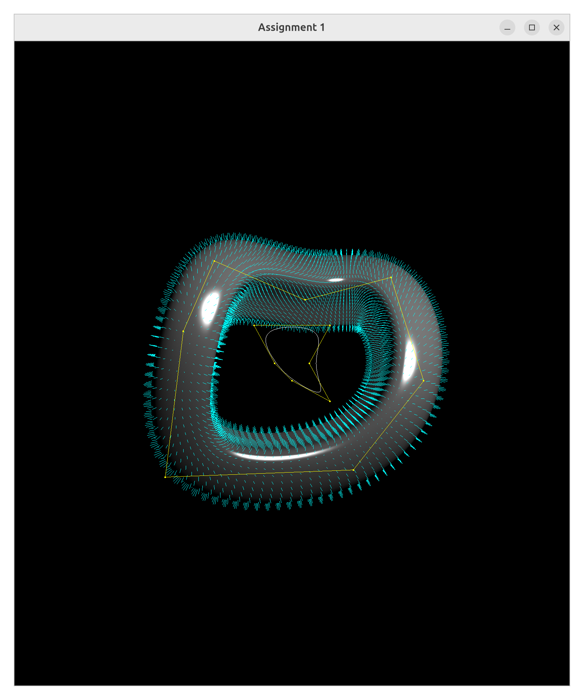

# 计算机图形学 Project 1 实验报告

> **课程**：CS30019.02 计算机图形学 ｜ **学期**：2026 春
> **小组成员**：_刘卓鑫 / 24300240170_ ｜ _朱劲舟 / 24300240117_
> **提交日期**：2026-04-17

## 一、实验概述

本项目在课程提供的 `starter1` 框架上完成，核心目标为：

- 基于控制点生成分段三次 **Bezier** 与三次 **B-spline** 曲线；
- 为曲线上每个采样点建立 **Frenet-like 局部坐标系** `(T, N, B)`；
- 以曲线为 profile/sweep，构造 **旋转曲面 (`makeSurfRev`)** 与 **广义圆柱面 (`makeGenCyl`)**；
- 导出三角网格并可输出为 `.obj`。

主要实现集中在 [starter1/src/curve.cpp](starter1/src/curve.cpp) 与 [starter1/src/surf.cpp](starter1/src/surf.cpp) 两个文件。

## 二、开发与运行环境

- 语言 / 构建：C++ + CMake，依赖 GLFW、GLEW、vecmath；
- 平台：Linux / WSL + WSLg（脚本自动设置 Wayland / X11 环境变量）；
- 构建：
  ```bash
  cmake -S starter1 -B starter1/build
  cmake --build starter1/build -j4
  ```
- 运行：
  ```bash
  starter1/run_pj1.sh starter1/swp/core.swp
  # 导出 obj
  starter1/run_pj1.sh starter1/swp/weirder.swp /tmp/pj1_out
  ```
- 交互：`c` 切换坐标系、`p` 切换控制点、`s` 切换曲面模式、`Space` 重置视角，详见 [main.cpp:90-125](starter1/src/main.cpp#L90-L125)。

## 三、关键模块实现

### 3.1 分段三次 Bezier 曲线

见 [curve.cpp:21-74](starter1/src/curve.cpp#L21-L74)。

采用矩阵形式 `Q(t) = G · M · T(t)`，其中

- 几何矩阵 `G` 由四个控制点构成；
- 基矩阵

  ```text
  M = | 1  0  0  0 |
      |-3  3  0  0 |
      | 3 -6  3  0 |
      |-1  3 -3  1 |
  ```

- 参数向量 `T(t) = (1, t, t², t³)ᵀ`，切向量用 `dT = (0, 1, 2t, 3t²)ᵀ`。

实现要点：

1. 控制点数必须满足 `3n+1`，每 3 点构成一段，段间共享端点；
2. 为避免端点重复，除最后一段外循环跳过 `j == steps` 的样本 ([curve.cpp:49-52](starter1/src/curve.cpp#L49-L52))；
3. 局部坐标系采用 **相邻帧传播（Frame Propagation）**：
   - **2D 情形** 可直接固定次法线 `B = (0,0,1)`，此时 `N = B × T` 恰好指向曲线遍历方向的左侧（参考 PPT p12「右手定则」）。这种做法避免了使用二阶导数 `N = T'/‖T'‖`——后者在拐点处会翻转方向、在直线段处会除零。
   - **3D 情形** 必须逐点递推：

     ```text
     初始化：B₀ = (0,0,1)  （或任何与 T₁ 不平行的单位向量）
             N₀ = normalize(B₀ × T₀)
     递推：  Nᵢ = normalize(Bᵢ₋₁ × Tᵢ)
             Bᵢ = normalize(Tᵢ × Nᵢ)
     ```

     含义：让第 i 点的法向量尽可能接近第 i−1 点的法向量，同时满足 `N ⊥ T`。这样既绕开了 2D 的翻转问题，也绕开了 3D 中 `T = B_const` 导致 N 不定义的退化情形。
   - 实现位置：[curve.cpp:58-67](starter1/src/curve.cpp#L58-L67) 对 Bezier 首点用 `B₀=(0,0,1)`，其余点沿用前一点的 `B` 做叉积。

### 3.2 三次 B-spline 曲线

见 [curve.cpp:76-144](starter1/src/curve.cpp#L76-L144)。

采取 **"B-spline → Bezier 控制点"** 的转换策略：对任意 4 个相邻 B-spline 控制点，利用基矩阵换算求得等价 Bezier 段的控制点，然后复用 `evalBezier` 求值。

换算公式：由 `G · M_bspline · T(t) = G_bezier · M_bezier · T(t)`，得

```text
G_bezier = G · M_bspline · M_bezier⁻¹
```

其中

```text
M_bspline⁻¹·18 并非必需，这里用到的是：
M_bezier⁻¹ = | 3 3 3 3 |
             | 0 1 2 3 |
             | 0 0 1 3 |
             | 0 0 0 3 |
```

实现细节：

- 将 `G_trans` 每列除以 18 即得等价 Bezier 控制点；
- 每段结果追加到总曲线时去掉末点，避免重复；
- B-spline 子段复用 `evalBezier` 后，在 [curve.cpp:127-141](starter1/src/curve.cpp#L127-L141) 重算一次 `N / B`，**保证段与段交界处局部坐标系连续**——这是直接拼接 Bezier 段最容易忽略的细节。

### 3.3 旋转曲面 `makeSurfRev`

见 [surf.cpp:42-111](starter1/src/surf.cpp#L42-L111)。

- 前置检查 `checkFlat`：profile 必须落在 `xy` 平面；
- **前提假设**（来自 PPT p23）：profile 上所有点的 x 坐标均 ≤ 0（即曲线在 y 轴左侧）。否则平移会使原本指向 y 轴的法线反过来指向外侧，打破"反向后即朝外"的对称性；
- 以 `dθ = 2π/steps` 绕 **y 轴逆时针** 旋转（方向关乎下文三角形 winding 的正确性）：

  ```text
  Ry = | cosθ  0 -sinθ |
       |   0   1    0  |
       | sinθ  0  cosθ |
  ```

- **顶点法向取 `-N`** 的理由：按 3.1 节约定，2D profile 的法线 `N = B × T` 指向遍历方向左侧；在 `x ≤ 0` 的 profile 上这恰好朝向 y 轴（内侧）。因此曲面外法向需要反转一次，见 [surf.cpp:62](starter1/src/surf.cpp#L62)；
- **法线的逆转置变换**：若顶点用仿射矩阵 `M` 变换，则法线应当用 `M` 左上 3×3 子块的 **逆转置** 变换，以保持 `n · t = 0` 在切向量也被变换后仍然成立。对本函数使用的旋转矩阵 `Ry`，其为正交矩阵，`Ry⁻ᵀ = Ry`，所以代码里直接写 `Ry_inv = Ry` 是合理简化（广义圆柱中仿射矩阵非正交，必须显式求 `M⁻ᵀ`）；
- **三角化与 winding（逆时针）**：设相邻两圈 profile 样本为

  ```text
  i 圈:   C ── A
          │    │
  i+1 圈: D ── B
  ```

  其中 A、C 同处 profile 曲线（profile 索引 j+1 / j），B、D 同处下一圈（profile 索引 j+1 / j），且纵向（A↕B、C↕D）沿 sweep 方向。从曲面外侧看过去，按 **ACB** 与 **BCD** 顺序写入三角形，即"右上→左上→右下"和"右下→左上→左下"，在屏幕坐标系中呈逆时针（CCW），对应代码 [surf.cpp:89-90](starter1/src/surf.cpp#L89-L90)。这与 main.cpp 中 [`glEnable(GL_CULL_FACE); glCullFace(GL_BACK)`](starter1/src/main.cpp#L257-L258) 配套——一旦 winding 写反，背面剔除会把本该可见的面剔掉（表现为"曲面半边透明"）；
- **封口**：最后一圈（i == steps-1）的三角形索引不再指向 `i+1` 圈，而是指回第 0 圈的顶点（[surf.cpp:92-96](starter1/src/surf.cpp#L92-L96)），从而形成完全闭合的旋转体。

### 3.4 广义圆柱面 `makeGenCyl`

见 [surf.cpp:119-205](starter1/src/surf.cpp#L119-L205)。

核心思路：沿 `sweep` 曲线的每个采样点建立局部坐标基 `(N, B, T)`，把 profile 映射到该基下。

- 变换矩阵：

  ```text
  M = [ N  B  T  V ]      (4×4)
  ```

  其中 `V` 为 sweep 点坐标，放置于第四列；
- 顶点用 `M · (profile.V, 1)ᵀ`，法向用 `(M⁻ᵀ) · (-profile.N, 0)ᵀ` 并归一化，保证在非正交缩放下法向仍正确 ([surf.cpp:178-179](starter1/src/surf.cpp#L178-L179))；
- **闭合扫掠的扭转补偿 / 罗德里格斯旋转**（对应 PPT p29–p30 拓展任务，专门占 1 分）：

  _何时触发_：检测条件为 `sweep` 首末两点的位置与切向 `T` 相同，但 `N` 不同（即首末坐标系只差一个绕 `T` 的旋转），详见 [surf.cpp:141-154](starter1/src/surf.cpp#L141-L154)。

  _旋转角 α 的计算_：令 `a = N₀`, `b = N_end`, `t = T₀`，用带符号的 `atan2` 形式

  ```text
  α = atan2( (a × b) · t ,  a · b )
  ```

  其中 `(a × b) · t` 给出绕 `t` 的有符号正弦分量，`a · b` 给出余弦分量，这样 α ∈ (−π, π] 符号正确。

  _插值策略_：将 α 均匀分摊到每一采样点，令 `θᵢ = −α · i / (N_sweep − 1)`，在原坐标系 `(N, B, T)` 基础上绕 `T` 旋转 θᵢ 得到新基 `(N', B')`。根据罗德里格斯公式，又因 `B = T × N` 已在平面 `<N, B>` 内，该旋转退化为二维形式：

  ```text
  N' =  cos θ · N + sin θ · B
  B' = −sin θ · N + cos θ · B
  ```

  对应代码 [surf.cpp:164-165](starter1/src/surf.cpp#L164-L165)，在 sweep 走到末端时 θ = −α，恰好把末端 `N` 转到起点 `N₀`，接缝对齐，从而 `weirder.swp` / `florus.swp` / `flircle.swp` 显示为无缝闭合。

  _对非闭合曲线的影响_：若首末不满足触发条件，α 保持为 0，`θᵢ ≡ 0`，新基与原基完全一致，**不影响开放 sweep 的结果**，满足 PPT "不应影响其他未闭合曲线" 的要求。

- 三角化方式与旋转曲面一致（逆时针 ACB/BCD），最后一圈闭合回第 0 圈。

## 四、样例与结果

`starter1/swp/` 下共 10 个样例，对应输出如下：

### 4.1 基础曲线与局部坐标系

**`core.swp`** — 2D/3D Bezier 与 B-spline + 局部坐标系（`T`/`N`/`B` 三轴可视化）：



**`circles.swp`** — 两个同心圆曲线样例（最简曲线测试）：



### 4.2 旋转曲面 `makeSurfRev`

**`norm.swp`** — 旋转曲面法向展示，验证外法向方向正确：



**`wineglass.swp`** — 酒杯形旋转曲面，验证杯口/杯底细节：


### 4.3 广义圆柱 / 扫掠曲面 `makeGenCyl`

**`tor.swp`** — 基础环面扫掠：



**`gentorus.swp`** — 花形 profile × 圆环 sweep：


**`weird.swp`** — 3D B-spline sweep + 2D profile：



### 4.4 闭合 sweep（验证扭转补偿）

**`flircle.swp`** — 闭合 B-spline sweep × 圆 profile：



**`florus.swp`** — 闭合复杂 profile × 圆 sweep：



**`weirder.swp`** — 更复杂的闭合 sweep，重点考验首尾扭转补偿：



---

从 `core.swp` 结果可直观看到：

- 4 条曲线分别对应 2D Bezier、2D B-spline、3D Bezier、3D B-spline；
- 每个采样点均绘制红(`N`)/绿(`B`)/蓝(`T`)三条极短坐标轴；
- 在分段过渡点与 3D 曲线的弯折处，坐标系无翻转或抖动，说明帧传播算法工作正常。

旋转/扫掠样例中，闭合 sweep 的样例（`flircle`、`florus`、`weirder`）首尾过渡平滑，验证了第 3.4 节的扭转补偿；`wineglass` 的杯口、杯底细节完整，验证了旋转曲面的法向方向选取正确（光照下无 "里面翻黑" 现象）。

## 五、实现中遇到的问题与解决

1. **B-spline 段间法向跳变**：直接在每段 Bezier 内部独立初始化 `N` 会在交界处出现 180° 翻转。解决方案是在 `evalBspline` 末尾对整条曲线统一用"帧传播"重算 `N / B` ([curve.cpp:127-141](starter1/src/curve.cpp#L127-L141))。
2. **旋转曲面法向方向**：最初使用 `+N`，光照下部分三角形朝内。原因是 profile 上的 `N` 指向曲率中心（即轴向内侧），对旋转体而言外法向应取反 ([surf.cpp:62](surf.cpp#L62))。
3. **闭合 sweep 扭转**：在未做补偿时，`weirder.swp` 接缝处会出现"拧麻花"。通过比较首尾坐标系的 `N` 绕 `T` 的夹角并均匀回转，解决该问题。
4. **法向在一般变换下的正确变换**：`M` 非严格正交（包含平移但保证旋转），因此法向使用 `M⁻ᵀ` 最稳妥，防止缩放/剪切时法向失真。

## 六、总结

项目完整实现了 Bezier / B-spline 曲线求值、局部坐标系构建、以及基于 profile+sweep 的两类扫掠曲面。核心矩阵运算全部借助 `vecmath` 完成，代码结构清晰：

- 曲线层面以矩阵 `G·M·T(t)` 统一描述两种样条，并通过"基变换转 Bezier"复用代码；
- 曲面层面将旋转曲面视为广义圆柱面的特例，二者共享"按圈三角化 + 封口闭合"的生成模板；
- 对闭合 sweep 的扭转补偿与法向变换处理，使生成网格在光照与 obj 导出下均保持干净。

完整源码与编译脚本详见 `starter1/`，样例与截图详见 `starter1/swp/` 与 `results/`。

